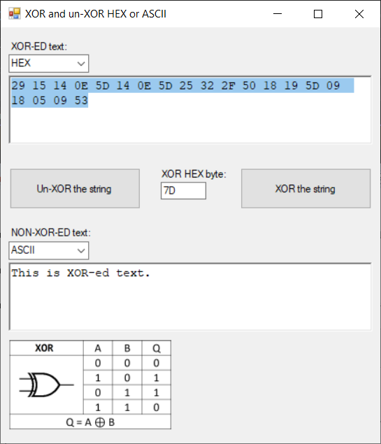

# XOR-and-un-XOR-HEX-or-ASCII
Simple program for XOR-ing and un-XOR-ing strings

## Usage:
Insert text eather as hex into upper textbox or readable string into bottom textbox, set xor value and press button to xor or un-xor.

